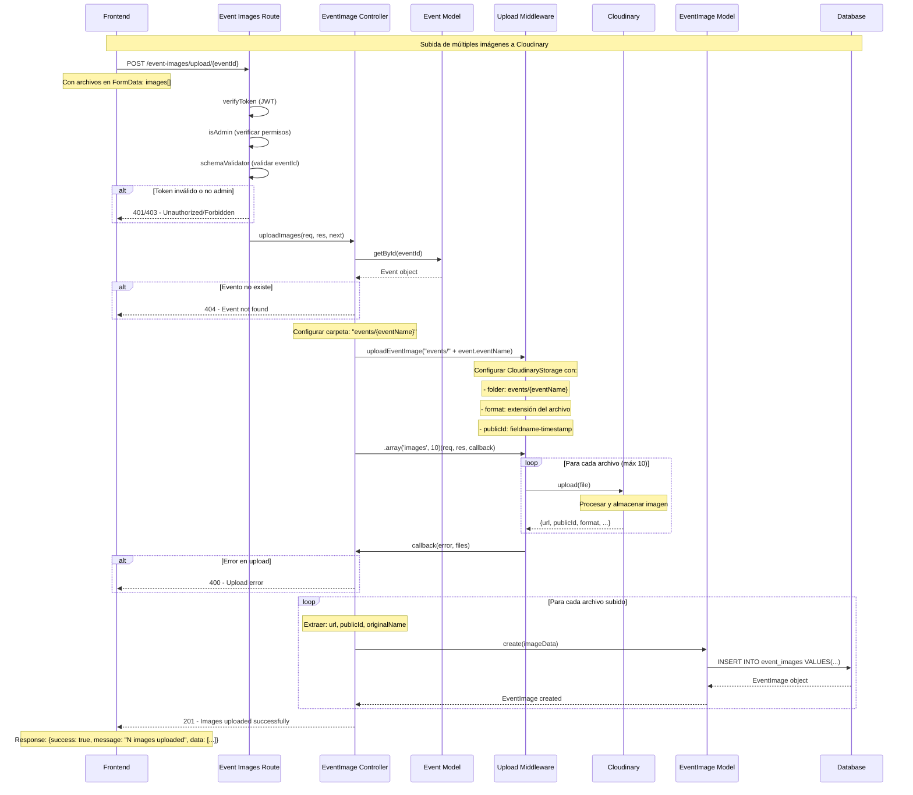
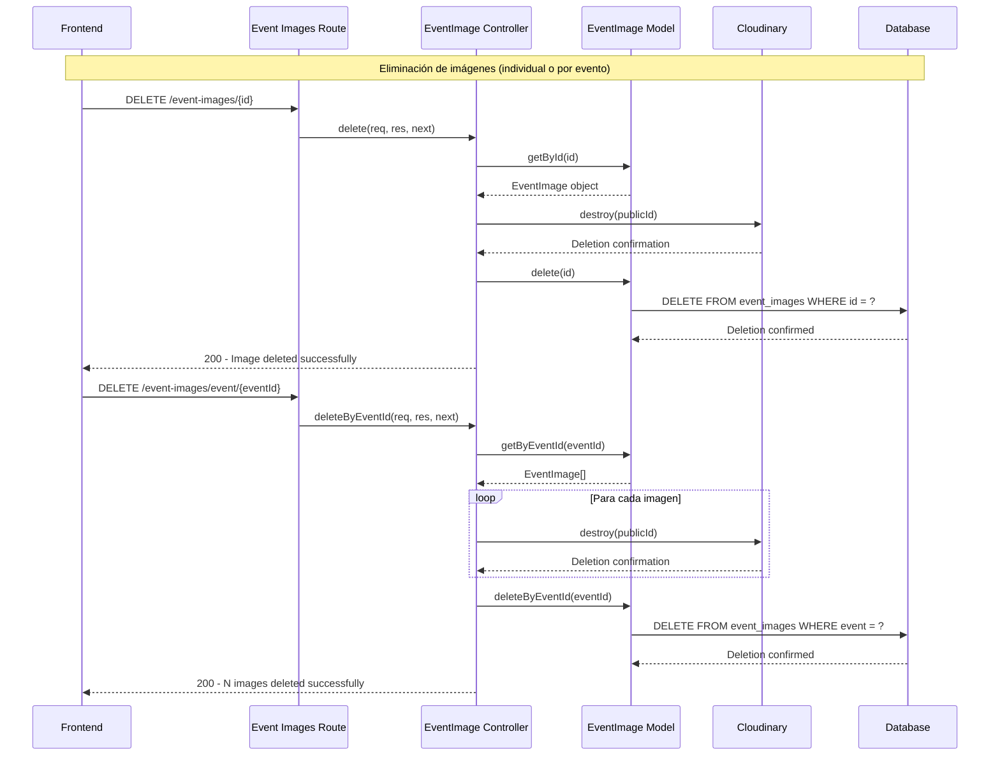

# Diagrama de Secuencia - Upload de Imágenes de Eventos a Cloudinary

## Flujo de Eliminación de Imágenes

## Características de Seguridad

### Autenticación y Autorización
- **JWT Token:** Requerido en header `Authorization: Bearer <token>`
- **Verificación de Admin:** Solo administradores pueden subir/eliminar imágenes
- **Validación de Evento:** Verifica que el evento existe antes de subir imágenes

### Validaciones de Archivos
- **Máximo 10 archivos** por petición
- **Límite de tamaño:** 15MB por archivo
- **Tipos permitidos:** Configurados en CloudinaryStorage
- **Organización:** Carpetas automáticas por evento `events/{eventName}/`

### Manejo de Errores
- **400:** Error en upload o validación de archivos
- **401:** Token faltante o inválido
- **403:** Usuario sin permisos de administrador
- **404:** Evento no encontrado
- **500:** Error interno del servidor